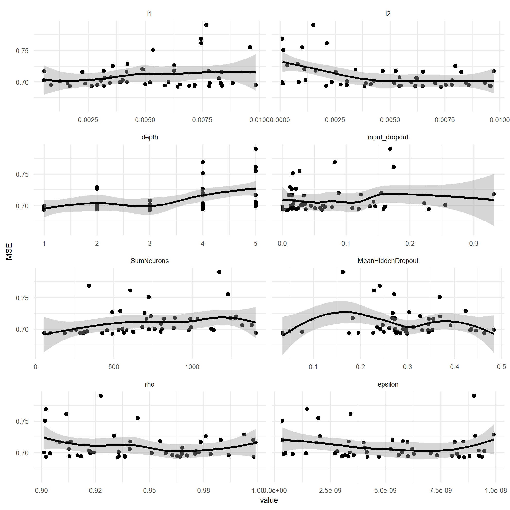
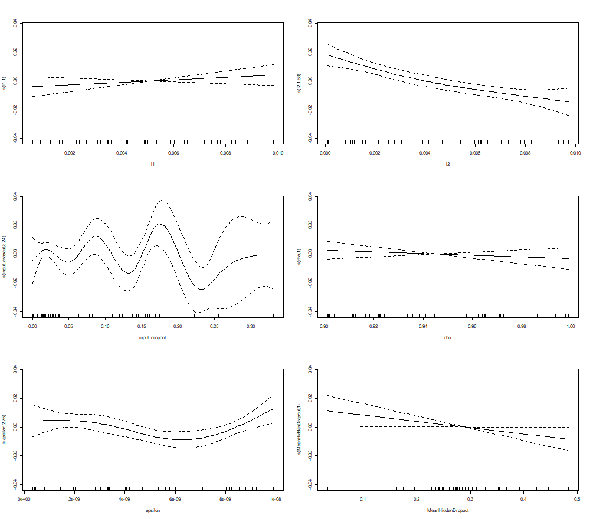
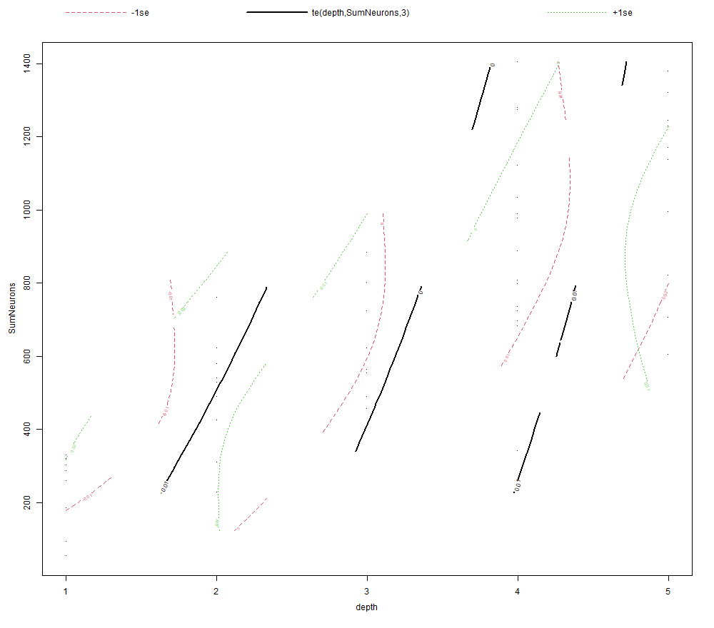
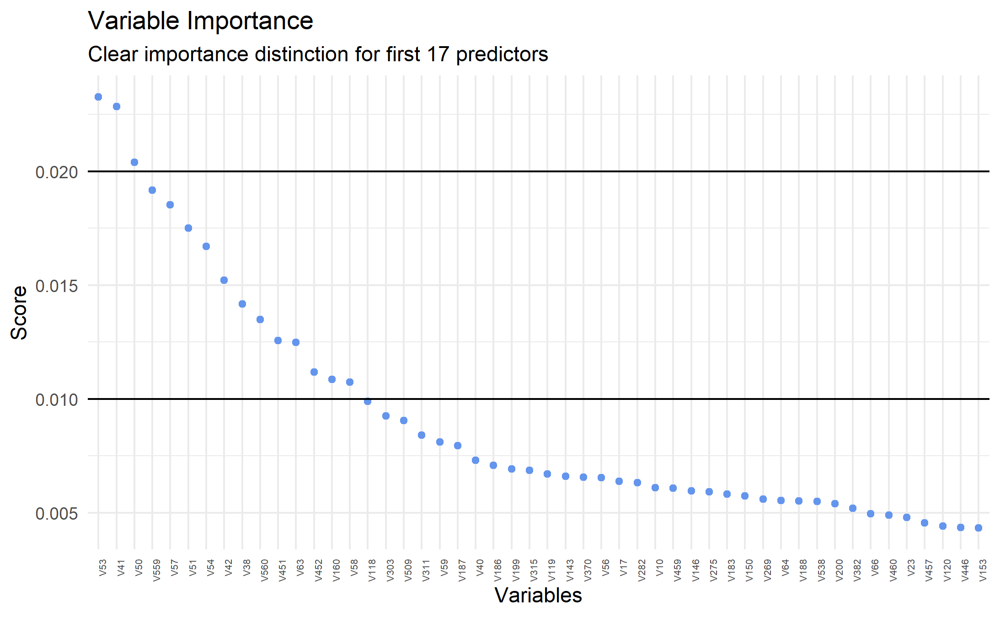
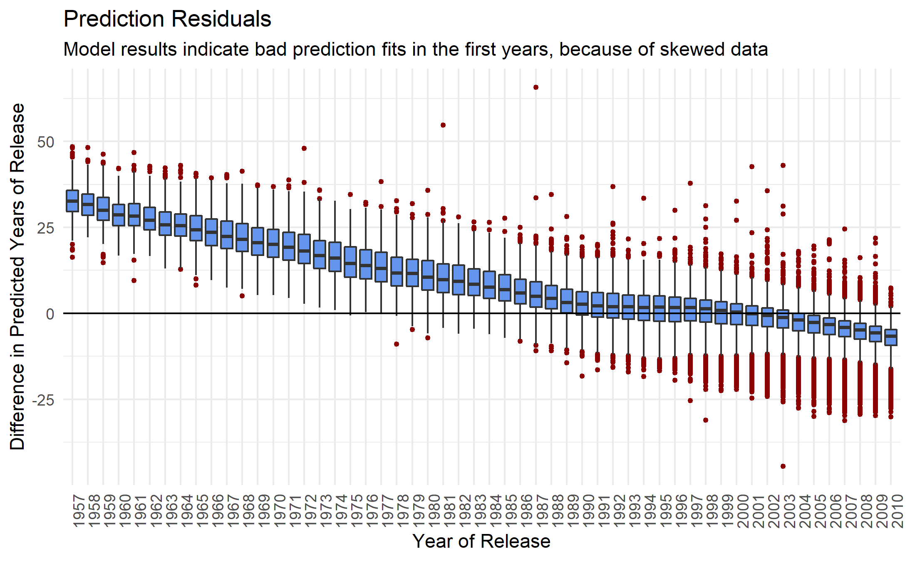

Goals and Procedure
-------------------

The aim of this short project was to get familiar with the DNN possibilities in R, especially while using caret, RSNSS, and h2o. Important emphasis was put on regularization, visualization, and variable importance techniques in order to make the results easily comprehensible. In terms of models, DNN architectures were mainly employed using random search in order to optimize the hyperparametrization of the underlying model.  

The main dataset to which most of the code and plots refer displays sensor data of smartphone users in order to predict their behavior. Other plots refer to movie and handwritten type classification datasets in order to visualize residual predictions.

Plot Overview
-------------

1. Hyperparameter Tuning 

2. GAM-based Hyperparameter Interaction

3. Depth-Neuron Interaction


Resulting Model & Variable Importance
---------------
```
if (exists("model.optimized") == FALSE) {
  model.optimized <- h2o.deeplearning(
    x = colnames(us_train.x),
    y = "Outcome",
    training_frame = h2o.tr,
    validation_frame = h2o.te,
    activation = "RectifierWithDropout",
    hidden = c(300, 300, 300),
    epochs = 100,
    loss = "CrossEntropy",
    input_dropout_ratio = .08,
    hidden_dropout_ratios = c(.50, .50, .50),
    l1 = .002,
    l2 = 0,
    rho = .95,
    epsilon = 1e-10,
    
    diagnostics = TRUE,
    export_weights_and_biases = TRUE,
    variable_importances = TRUE,
    model_id = "optimized_model"
)
}
```


Further Visualizations
---------------------




